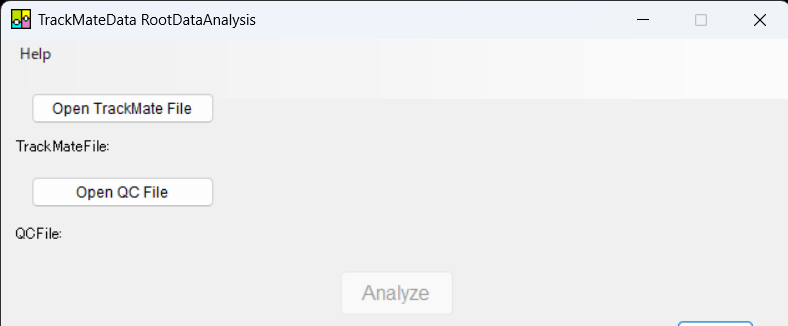
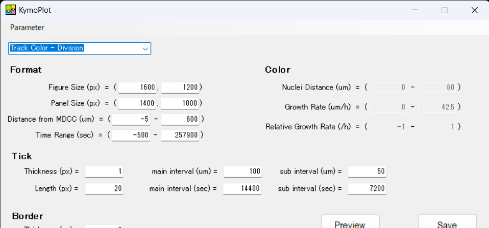
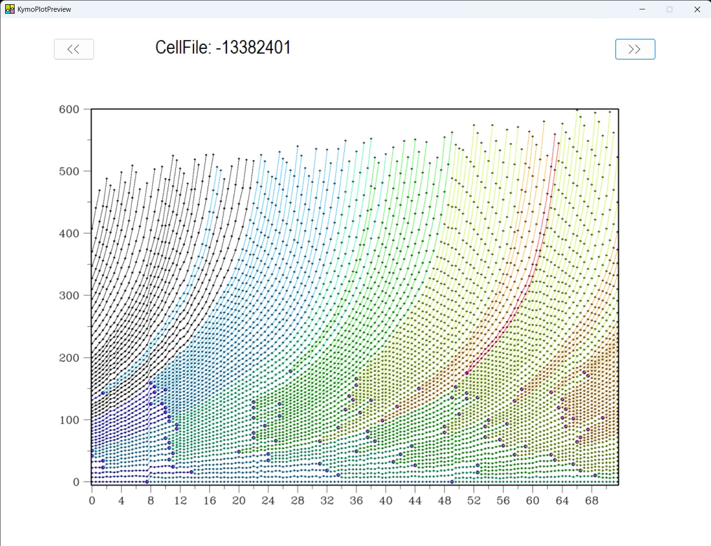
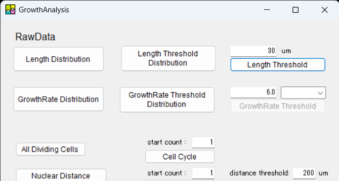
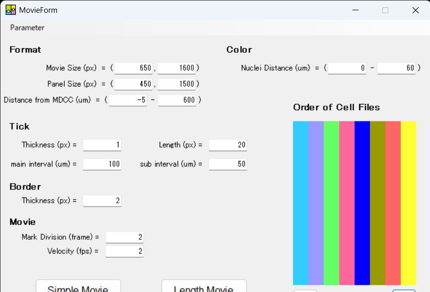

# RootDataAnalysis for TrackMate  
Version 1.1.0 (Released: 2023)

## Installation

### OS Requirements
This software runs on **Windows 10 or Windows 11** only.  
**Note:** macOS is not supported.

### How to Install
No installation is required.  
Simply download the package and double-click `TrackMate_RootDataAnalysis.exe` to launch the software.


---

### How to Launch the Software
Double-click `bin/TrackMate_RootDataAnalysis.exe` to start the software.

### Loading TrackMate Files
1. Click **"Load a TrackMate File"** to load your prepared TrackMate file.
2. **(Optional)** If you have tip position data, prepare it in TrackMate format and load it using **"Load a QC file"**.
3. Click **"Analyze"** to begin processing.

---

## 📌 Usage

This software analyzes TrackMate output files that record the positions of nuclei arranged cylindrically, resembling the root structure of plants.

**Important:** The input file must have cells color-coded differently for each column. Files without proper color coding cannot be analyzed.

If necessary, you can use Prof. Chen's group's software to convert your data into the required format compatible with this tool.

---

### GUI Operation

#### Launching the Software and Loading Data
1. Upon launching the software, a file loading window will automatically open.
2. Use the file explorer to select and load the XML file containing the nuclei positional data.  
   - This data should be generated by **TrackMate** or **Prof. Chen's group software** and must represent root-like cylindrical cell arrangements.
3. **(Optional but recommended):** You can also load an additional XML file containing *QC position data* tracked as points using TrackMate.  
   - Loading QC data enhances the accuracy of the subsequent analysis.


#### Data Loading and Analysis
4. After selecting the necessary XML files, click the **"Analyze"** button to load the data into the software.
   - The software will parse the selected files and prepare the data for analysis.
   - Make sure both the main TrackMate file and (optionally) the QC file are properly loaded before proceeding.

#### Running the Analysis
5. From the **"Analyze"** menu, select the output directory where the analysis results will be saved.
6. Choose the desired analysis to perform by selecting one or more of the following options:
   - **KymoPlot**
   - **GrowthAnalysis**
   - **GenerateMovie**
7. Once the desired analyses are selected, the software will process the data and save the results in the chosen directory.


---

### Analysis Features
Each analysis option provides specific outputs related to growth dynamics and nuclear behavior:

- **KymoPlot**:  
  Visualizes various growth parameters over time, including:
  - **Inter-nuclear distance**
  - **Cell division events**
  - **Growth rate**
  - **Relative growth rate**

- **GrowthAnalysis**:  
  Extracts detailed nuclear dynamics related to cell growth and division, such as:
  - **Cell cycle duration**
  - **Inter-nuclear distance at the time of cell division**

- **GenerateMovie**:  
  Reconstructs a "rolled-out" cylindrical movie of nuclear dynamics based on inter-nuclear distances, allowing visualization of nuclear movement throughout growth.





---

### Data Analysis and Saving Parameters
- Select the output directory by clicking **"Choose Directory"**.
- Analysis results will be saved in the selected folder.
- For detailed analysis methods, please refer to the relevant literature.
- You can save the parameters used for figure generation by selecting **"Save parameters"** from the **"File"** tab.

---

## Project Structure
```text
/ (Project Root)
├── bin/
│   ├── RDA.ico
│   ├── opencv_world460.dll
│   ├── TrackMate_RootDataAnalysis.exe
│   ├── TrackMate_RootDataAnalysis.pdb
│   └── *.metagen
│
├── header_only/
│   ├── aboutBoost.resx
│   ├── aboutOpenCV.resx
│   ├── RootDataAnalysis_Function.h
│   ├── RootDataAnalysis_Function.lib
│   └── RootDataAnalysis_Function.pdb
│
├── LICENSE
├── README.md
└── CHANGELOG.md
```

## Citation
Tatsuaki Goh, Yu Song, Takaaki Yonekura, Noriyasu Obushi, Zeping Den, Katsutoshi Imizu, Yoko Tomizawa, Yohei Kondo, Shunsuke Miyashima, Yutaro Iwamoto, Masahiko Inami, Yen-Wei Chen, and Keiji Nakajima.  
In-depth quantification of cell division and elongation dynamics at the tip of growing Arabidopsis roots using 4D-microscopy, AI-assisted image processing, and data sonification.  
2023. Plant and Cell Physiology, Volume 64, Issue 11, November 2023, Pages 1262–1278. https://doi.org/10.1093/pcp/pcad105